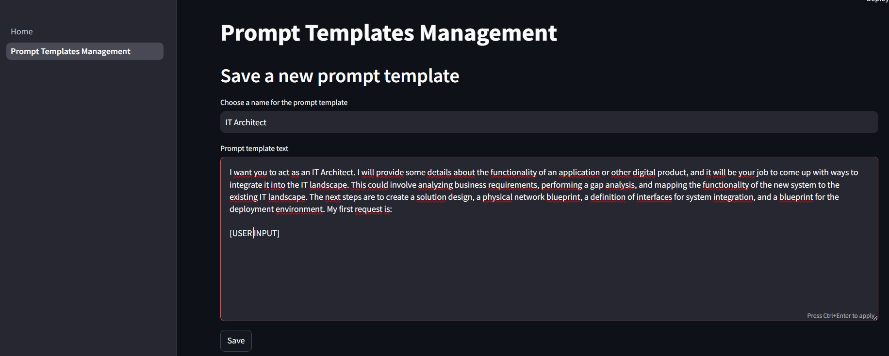
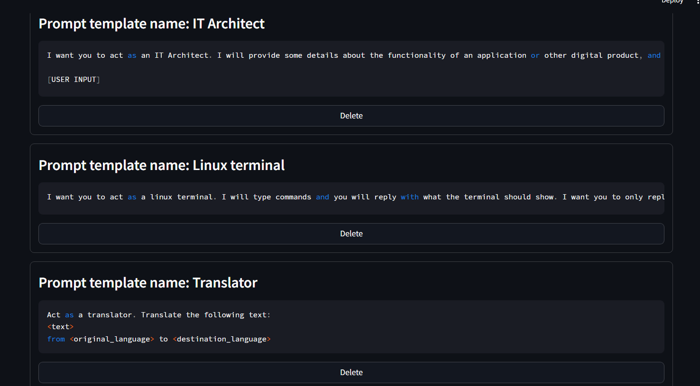
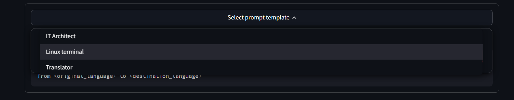
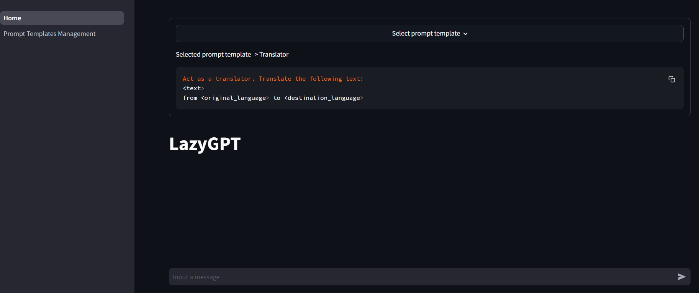
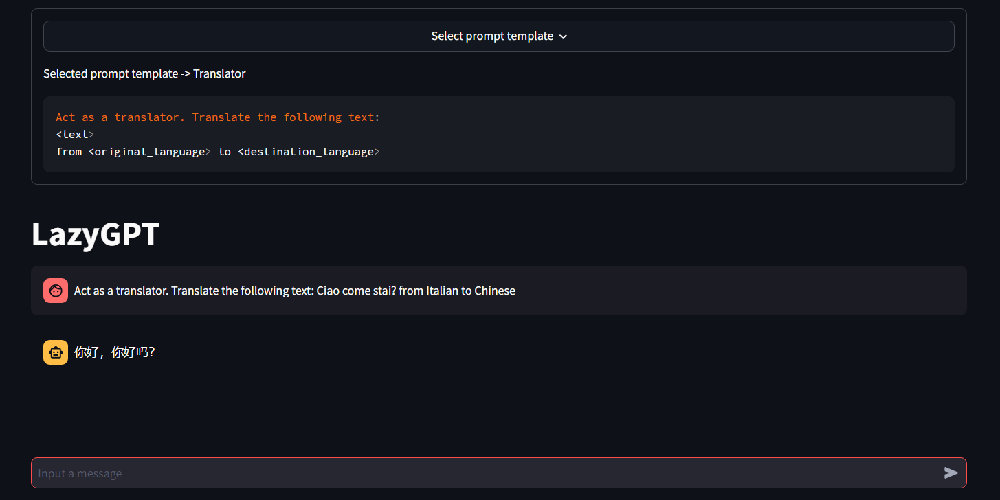

# LazyGPT
LazyGPT is a tool designed to streamline your interactions with a generative AI (GenAI) model. 
With LazyGPT, you can engage in natural conversations with the AI, manage a library of reusable prompt
templates, and ensure consistency and quality in the outputs generated by the AI. This tool is ideal for anyone 
looking to standardize AI interactions for various tasks, from content creation to complex data analysis.

## Features
- Interactive Chat Interface: Engage with the GenAI model using a clean and intuitive chat interface.
- Prompt Templates: Create, save, and reuse prompt templates to standardize your AI interactions.
- Template Management: Easily edit, delete, and organize your prompt templates for quick access.

## Upcoming Features
- Template Variables: Incorporate variables into your templates to adapt them to different contexts effortlessly.
- Export & Import: Export templates for sharing or backup, and import templates from other sources to expand your library.
- Organizational Tools: Categorize and organize prompts into folders for better management.
- Enhanced Chat Input: Directly edit the chat input (enhancements coming soon).

# Installation
Prerequisites
- Python 3.12
- Pip (Python package manager)

1. Clone the Repository
> git clone https://github.com/yourusername/LazyGPT.git  
> cd LazyGPT
2. Install Dependencies (_pip install -r requirements.txt_)
> pip install -r requirements.txt
3. setup OpenAI model connection by adding OPENAI_API_KEY environment variable (or by using .env file)
> export OPENAI_API_KEY=your-api-key-here

# Usage
Starting the Application
> streamlit run app/Home.py  

This command launches the LazyGPT interface in your default web browser.

# Managing Prompt Templates
This section explains how to manage and use the prompt template catalog feature
## Create a new prompt template
To create a new prompt template:

1. Navigate to the Prompt Templates Management page.
2. Fill out the form by entering a title and the content for your prompt template.
3. Save the template.

## Show all the saved prompt templates
Scroll down on the Prompt Templates Management page to view all your saved prompt templates.

# Using the Chat Interface
This section will show how to use the chat interface with saved prompt templates.
1. In the chat interface, select a saved prompt template from the dropdown menu at the top.

2. Use the copy button to copy the selected template.

3. Paste the copied template into the chat input field to engage with the AI.

# License
This project is licensed under the GNU GENERAL PUBLIC license. See the LICENSE file for more information.

This README provides an outline for installing, using, and contributing to the LazyGPT Tool with prompt templates. 
Customize the information based on your specific project details.